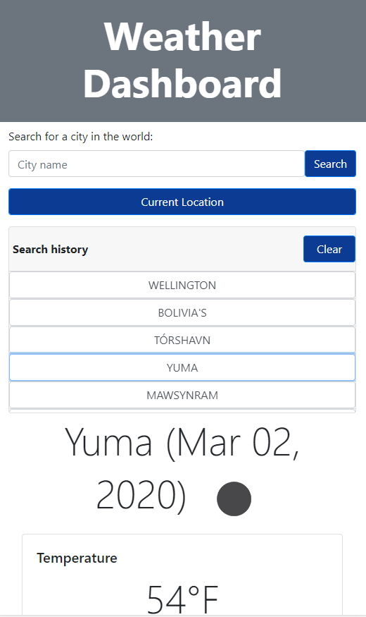

# Weather Dashboard

Developers are often tasked with retrieving data from another application's API and using it in the context of their own. Third-party APIs allow developers to access their data and functionality by making requests with specific parameters to a URL. In this example, I build a weather dashboard using the OpenWeather API and Bootstrap CSS Framework. This one page app is responsive on various mobile devices and tuned to load faster by eliminating render-blocking resources. The search history is stored in the local storage of the browser.

### Tools and concepts used
* Promise architecture to make async AJAX call
* Bootstrap CSS Framework to style
* JQuery package to manipulate DOM elements
* OpenWeather 3rd Party API to get real-time weather data
* JavaScript
* Chrome Lighthouse Audit to improve perf
* Moment.JS NPM package to do date calculations
* PurgeCSS NPM package to remove unused CSS
* Chrome DevTool to style and make the app responsiveness
* Local Storage to store search history

### Desktop View

***
### Tablet View

***
### Phone View

***
### Small Phone View

***
