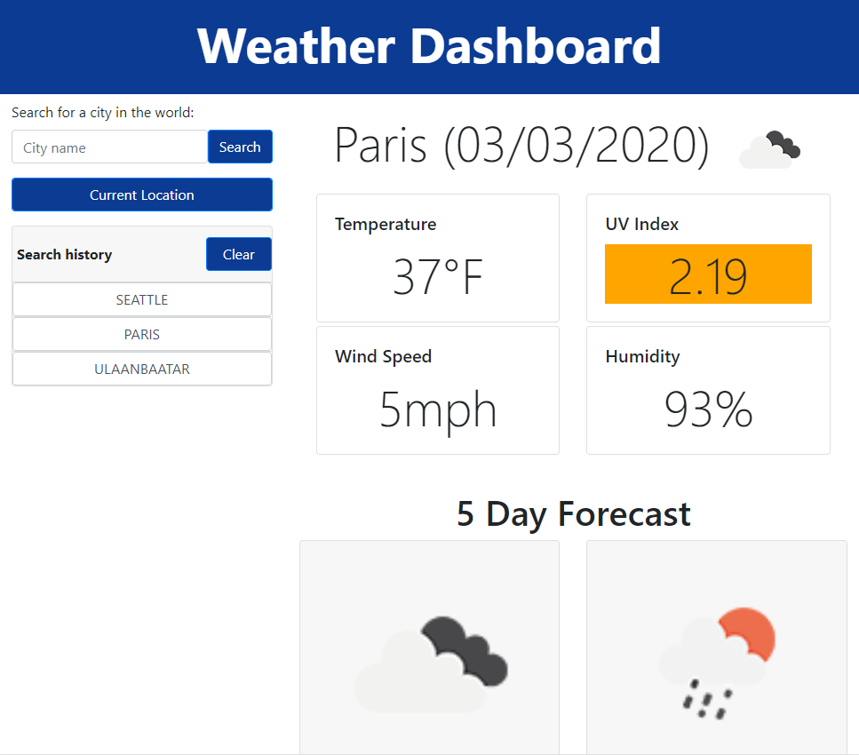
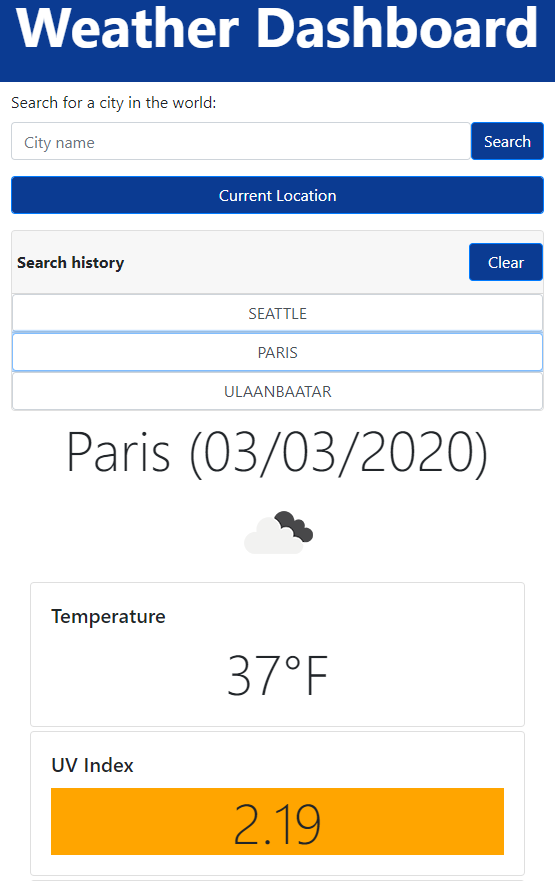

# Server-Side APIs Example: Weather Dashboard

Developers are often tasked with retrieving data from another application's API and using it in the context of their own. Third-party APIs allow developers to access their data and functionality by making requests with specific parameters to a URL. In this example, I build a weather dashboard using the OpenWeather API and Bootstrap CSS Framework. This one page app is responsive on various mobile devices and tuned to score above 90 by Chrome Lighthouse audit. The search history is stored in the local storage of the browser.

***

***

***

***

